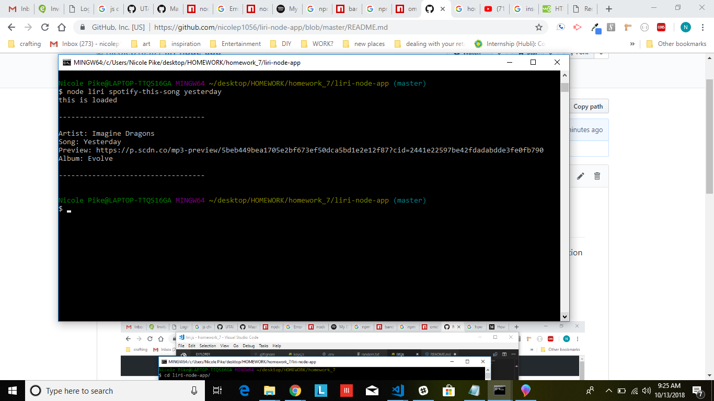
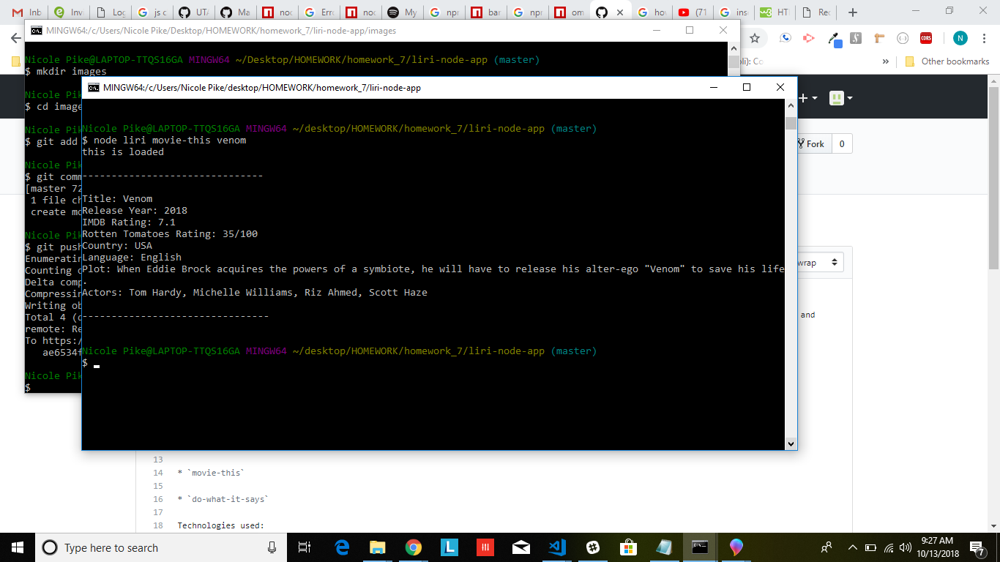
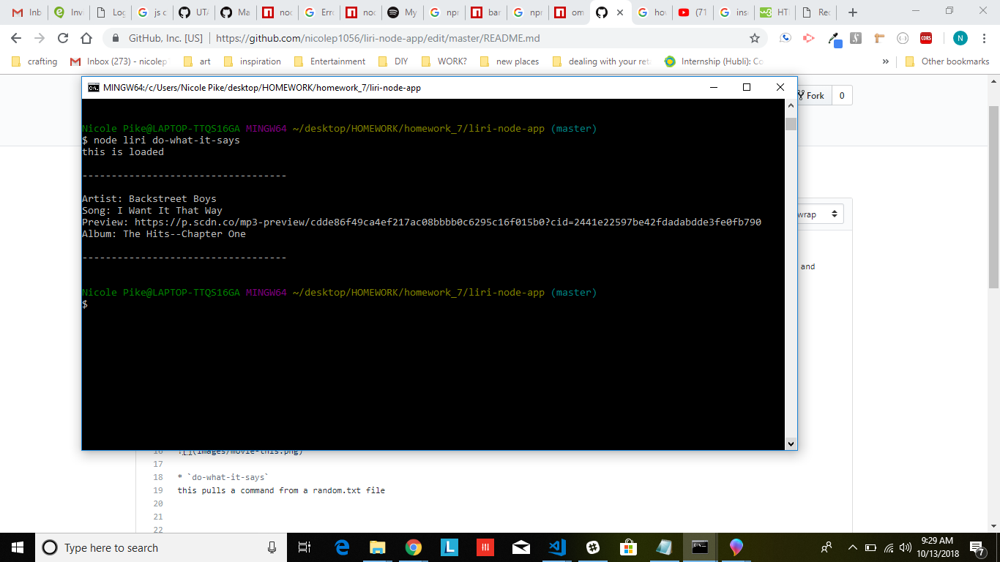

# liri-node-app

LIRI is similar to SIRI, but is a Language Interpretation and Recognition Interface, as opposed to being a Speech Interpretation and Recognition Interface.  LIRI is a command line node app that takes in parameters and gives you back data.

LIRI responds to the following commands:
* `concert-this`

* `spotify-this-song`
if no song is specified, it will pull up info for "The Sign" by Ace of Base

* `movie-this`
if no movie is specified, it will pull up info for Mr. Nobody

* `do-what-it-says`
this pulls a command from a random.txt file

Technologies used:
* Node.js
* Javascript
* npm packages: 
     * node-spotify-api
     * request (grabs data from OMDB api and Bands in Town api)
     * moment
     * DotEnv

